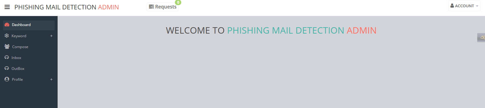

<h1 align="center">Phishing Email Detection</h1>
We made a project name "Phishing Email Detection" which scans and detects suspicious mail between sender and receiver.

## Instructions:
- Move all files of phishing_mail_detection to C:\xampp\htdocs
- Open your XAMPP control panel and start the Apache and MySQL services.
- Access phpMyAdmin- http://localhost/phpmyadmin
- Create a new database named "phishing_mail_detection" and import "phishng_detection.sql"
- Move all your project files and folders  to the "htdocs" folder inside your XAMPP installation directory. 
- For run: http://localhost/Phishing_Mail_Detection
- For admin page login, go- http://localhost/Phishing_Mail_Detection/admin_index.html

## Some Photos of this project:

## Creators

- <https://github.com/araf5/Cyber-Security--CSE-323>

## References:
- https://www.activestate.com/blog/phishing-url-detection-with-python-and-ml/
- https://sennovate.com/the-role-of-artificial-intelligence-in-detecting-phishing-attacks/

## Copyright and license

Code and documentation copyright 2024 the authors. for Cyber Security (CSE-323) Course purpose

## Submitted To-
**Md Riad Hassan Sir**

## For any quaries

Inform us
We are:
|        Name           |     ID     | 
|      --------         |  --------  |
| Md  Yeasin Arafat     | 211002121  |
| Ummay  Habiba Reene   | 193002004  |  
| Jubira Khanam Tamanna | 211002125  |
| Iftekher Ahmed Ayan   | 211002122  |

Or, mail me: 
[Email]: arafataraf0@gmail.com